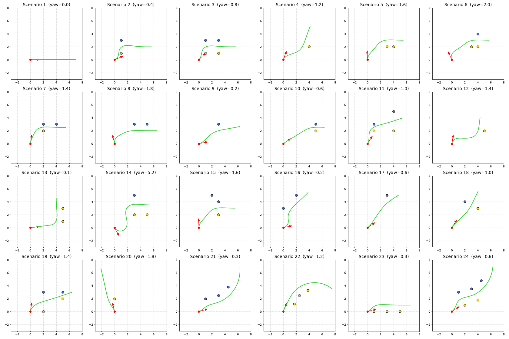

# FSAI Cone Track Path Planner

A simple path planner for an FSAI-style cone track. It is given the car pose `(x, y, yaw)` and a few
detected cones (blue = left edge, yellow = right edge), and returns a list of `(x, y)` points in
world coordinates that the car can drive, staying between the blue and yellow cones.

The original assignment is in [TASK.md](TASK.md). All the code is in
[`src/path_planning.py`](src/path_planning.py), in `PathPlanning.generatePath()`.



*All 24 test scenarios. The red dot and arrow show the car and its heading, blue and yellow are the
cones, and green is the planned path.*

---

## Quick start

```bash
python -m venv .venv
.venv\Scripts\activate          # Windows
# source .venv/bin/activate     # macOS / Linux
pip install -r requirements.txt

python -m src.run --scenario 14  # any scenario 1..24
```

> **No plot window?** If you see `FigureCanvasAgg is non-interactive`, your terminal forces
> matplotlib's image-only backend. Run `$env:MPLBACKEND="TkAgg"` (PowerShell) or
> `export MPLBACKEND=TkAgg` (bash) and try again.

## Project structure

| File | Purpose |
|---|---|
| `src/models.py` | Data types: `Cone(x, y, color)`, `CarPose(x, y, yaw)`, `Path2D` (list of points) |
| `src/path_planning.py` | **The solution**: `PathPlanning.generatePath()` |
| `src/scenarios.py` | Test scenarios: 1-20 given, **21-24 added for Part 2** |
| `src/tester.py` | Plots cones, car, heading and the planned path (given) |
| `src/run.py` | Command line entry point: `python -m src.run --scenario N` (given) |
| `docs/all_scenarios.png` | Overview of the result for every scenario |

---

## Approach

The idea is the classic one: **the middle of the track is halfway between a blue cone and the yellow
cone opposite it.** We find those middle points, join them into a smooth centreline, and then let a
simple car model **drive** along that line. The path we return is where the car actually drives, so
it always starts in the direction the car is facing and never turns tighter than a car can.

```
cones + car pose
   |
   +- 1. move everything into the car's own frame
   +- 2. find centre points of the track
   +- 3. order them, add an entry point, extend past the last one, round corners  -> reference centreline
   +- 4. drive a car model along the centreline (pure pursuit, limited turn radius) -> path
   +- 5. move the path back to world coordinates
```

### 1. Car frame

All maths is done in the car's local frame: the car is at `(0, 0)`, `+x` is straight ahead and
`+y` is to the car's left. Each cone is shifted by the car position and rotated by `-yaw`
(a 2D rotation matrix):

```
x_local =  cos(yaw)*dx + sin(yaw)*dy
y_local = -sin(yaw)*dx + cos(yaw)*dy
```

In this frame "is it ahead?" is just `x > 0` and "is it on the left?" is `y > 0`. At the end every
path point is rotated by `+yaw` and shifted back, because the tester expects world coordinates.

### 2. Centre points

| Cones visible | How the centre points are found |
|---|---|
| Blue **and** yellow | Each cone on the side with more cones is paired with the **nearest cone of the other colour**. The midpoint of each pair (a "gate") is a centre point. The track runs perpendicular to the yellow->blue line. |
| Only one colour, 2+ cones | The cones form a line (the track direction). Each cone is moved **half a track width (1 m) inwards**: to the right of blue cones, to the left of yellow cones. |
| Only one colour, 1 cone | The cone is moved 1 m inwards. With one cone there is no direction, so the track is assumed to run along the car's heading. |
| No cones | No centre points; the car drives straight ahead. |
| **3+ cones of one colour** | Circle fit, see [Part 2](#part-2--three-cones-on-one-side). |

### 3. Reference centreline

* **Ordering (`_chain`)**: starting at the car, repeatedly go to the nearest remaining centre point
  that is **in front of** the current direction (positive dot product). Points that would make the
  path turn back on itself are dropped.
* **Entry point**: a point is added up to 1 m before the first centre point, along the track
  direction. The car then lines up with the track before passing between the cones instead of
  cutting diagonally past one.
* **Extension**: after the last centre point, the line continues in the track direction.
* **Rounding (`_smooth`)**: the line is cut into ~1 m pieces and smoothed with **Chaikin's corner
  cutting** (3 rounds), which turns sharp corners into curves.

### 4. Driving it: pure pursuit with a turn limit (`_pure_pursuit`)

A centreline drawn only from cones ignores the car. If the car points the "wrong" way (scenario 14
faces down-right while the track is up and to the left), a line from cones would start with an
impossible 120 degree turn on the spot. So the final path is produced by **simulating a simple
car**:

* It starts at the real pose, **facing the real yaw**.
* Every 5 cm it looks **1 m ahead** along the centreline and steers toward that point using the
  **pure pursuit** law `curvature = 2*sin(a) / distance`, where a is the angle between the car's
  heading and the target.
* Curvature is limited to `1 / MIN_TURN_RADIUS`. If the target is behind the car, it steers at full
  lock.
* A path point is recorded every **0.25 m**. The simulation stops once the car is a bit past the
  last centre point. The length is always kept between 7 and 10 m.

The result is a path that **starts tangent to the car's heading** and that **the car can actually
drive**. When the car is pointing away from the track, the path is a proper U-turn into the track
(scenario 14).

---

## Part 2: three cones on one side

### Approach

With two cones on a side you can only draw a straight line through them. **Three cones define a
circle**, and a circle captures how the track bends:

1. Take the 3 nearest cones of that colour and compute the **unique circle through them**
   (closed-form formula, `_circle_through`).
2. The sign of the cross product `(p2-p1) x (p3-p2)` says whether the track bends **left** or
   **right**.
3. Offset the circle **towards the middle of the track**. Blue cones are the inner edge of a left
   turn, so there the centreline radius is `R + w/2`. In a right turn it is `R - w/2`. For yellow
   cones it is the other way round. `w/2` is 1 m, or **half the measured distance to the
   other-colour cones** if any are visible (scenario 24).
4. Follow the offset circle from the first cone, past the last one, and **90 degrees further**, predicting
   that the corner continues. This arc is the reference centreline, which the car model then drives
   (step 4 above).
5. If the 3 cones are (almost) in a straight line, the circle radius exceeds 50 m. The planner then
   falls back to the normal straight-line method (scenario 23).

### Why this solution

* **Three points determine exactly one circle.** No fitting, tuning or optimisation is needed; it is
  a closed-form formula.
* A circle is the **simplest curve that can bend**: one radius and one direction. Corners on cone
  tracks are mostly built as constant-radius arcs, so it is a good local model.
* It gives everything the planner needs directly: **which way** the track turns, **how sharply**,
  and a natural way to **extrapolate** beyond the last cone.
* It slots into the existing pipeline. The circle just replaces the centre points, and the same
  car-model step produces the final path.
* Alternatives I considered:
  * A **parabola** fit depends on how the axes are oriented and behaves badly for steep or U-shaped
    turns.
  * A **spline** passes through the points but extrapolates poorly.
  * A **straight line** throws away the curvature, which is the whole point of having a third cone.

### Limitations

* **Constant curvature only.** It cannot represent an S-bend or a corner that tightens or opens up
  (a clothoid).
* **Sensitive to cone position errors** when the 3 cones are close together: a few cm of noise can
  change the radius a lot. With more cones, a least-squares circle fit would be more robust.
* **Extrapolation is a guess.** The path keeps turning 90 degrees past the last cone (scenario 22). If the
  track straightens out, the car only sees that once new cones arrive.
* With **more than 3 cones** on a side, only the nearest 3 are used for the shape. If **both** sides
  have 3+ cones, only one side defines the shape; the other side only sets the width.

### New test scenarios (in `src/scenarios.py`)

| # | Cones | What it tests |
|---|---|---|
| 21 | 3 blue, curving left | Left turn, only the inner edge visible |
| 22 | 3 yellow, curving right | Right turn, only the inner edge visible, plus the extrapolation |
| 23 | 3 yellow in a straight line | Collinear cones -> fallback to the straight-line method |
| 24 | 3 blue curving left + 2 yellow | Track width **measured** from the other side instead of assumed |

---

## Assumptions

| Assumption | Reason |
|---|---|
| Track width is **2 m**, so the centreline is 1 m from a single row of cones | With one side visible the width is unknown; cones in the scenarios are 1-3 m apart. Measured from the other side whenever possible. |
| **Cone colours are always correct** | Blue is the left edge of the *track*, even if it appears to the right of the car's current heading. That only means the car must turn. |
| **All given cones are used**, including ones behind the car | Ignoring them broke scenario 14, the only one with cones behind the car. |
| **One cone only: the track runs along the car's heading** | A single cone gives a position but no direction. |
| **Minimum turn radius 1 m** | A real FS car turns at about 4-5 m, but this grid is scaled down (a 2 m track, cones 1-2 m apart). 1 m keeps the same proportions. |
| **Path length 7-10 m, one point every 0.25 m** | The task asks for 5-10 m with steps <= 0.5 m. |
| The car is a simple kinematic vehicle (constant speed, no slip) | Enough for planning a feasible geometric path. |

## Results and validation

Every scenario was checked automatically:

| Check | Result |
|---|---|
| Length 5-10 m, step <= 0.5 m | All 24 pass (about 7-10 m, 0.25 m steps) |
| Path starts in the car's heading direction | All 24 pass |
| Never turns tighter than the 1 m minimum radius | All 24 pass |
| Blue cones on the path's left, yellow on its right | All 24 pass |
| Path never crosses a track edge (line between two same-colour cones) | All 24 pass |

## Limitations

* **Cars starting outside the track.** In most scenarios the car sits at `(0, 0)` beside or before
  the cones, so the path first has to enter the track. In scenario 2 the car points almost straight
  at a yellow cone. Even at full lock, the closest a car could pass is about 0.36 m from it.
* **Narrow gates.** Some blue/yellow pairs are only 1 m apart (scenarios 7, 10, 11, 19). The middle
  is then only 0.5 m from each cone.
* **Pure pursuit cuts corners slightly** and can swing a little wide when it has to turn hard
  (small S-bends in scenarios 13 and 16), as a real car would.
* **Nearest-cone pairing** can create a "fake gate" (one cone shared by two pairs) in unusual
  layouts. The ordering step limits the damage, but it is not a full track-boundary reconstruction.
  Something like Delaunay triangulation would be more robust.
* **No noise handling.** Cones are trusted exactly as given; there is no outlier rejection or colour
  correction.
* Only a short local path (<= 10 m) is planned from the cones currently visible, as the task asks.

## Tunable parameters (top of `src/path_planning.py`)

| Name | Value | Meaning |
|---|---|---|
| `HALF_TRACK_WIDTH` | 1.0 m | Distance from a cone row to the centreline when only one side is visible |
| `STEP` | 0.25 m | Distance between returned path points |
| `MIN_PATH_LENGTH` / `MAX_PATH_LENGTH` | 7 / 10 m | Path length limits |
| `EXTRA_LENGTH` | 1.5 m | How far to drive past the last centre point |
| `ENTRY_DISTANCE` | 1.0 m | Line up with the track this far before the first centre point |
| `SMOOTH_SPACING`, `SMOOTH_ITERATIONS` | 1.0 m, 3 | Corner rounding (Chaikin) |
| `MAX_ARC_ANGLE` | 90 degrees | How far the Part 2 circle is followed past the last cone |
| `MAX_CIRCLE_RADIUS` | 50 m | Larger circles are treated as straight lines |
| `MIN_TURN_RADIUS` | 1.0 m | Tightest turn the car model can make |
| `LOOKAHEAD` | 1.0 m | Pure pursuit look-ahead distance |
| `SIM_STEP` | 0.05 m | Simulation step of the car model |
